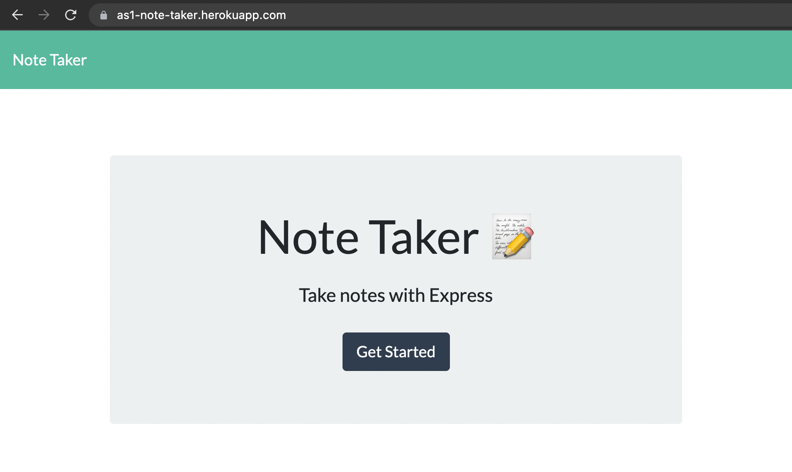
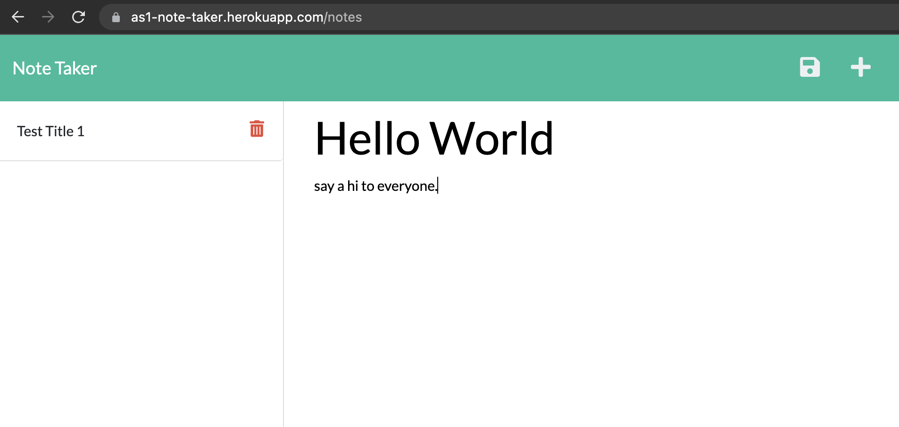
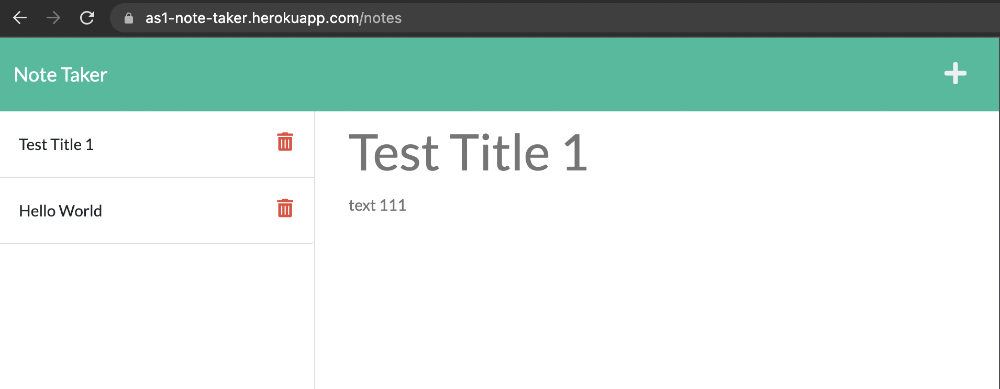

# NoteTaker

## Description
This project is creating an online note taker by using express.js

## Table of Contents
- [Installation](#installation)
- [Usage](#usage)
- [Credits](#credits)
- [License](#license)
- [Tests](#tests)

## Installation
N/A

## Usage
1. Go to URL https://as1-note-taker.herokuapp.com/

2. Click "Get Started"

3. Click "+", then type in the note title and text. when finish, click save icon to save.

4. Click the note title from left hand side to view the note detail

5. Click the delete icon beside the note title to delete the note.

## Credits

BenLiu104 : https://github.com/BenLiu104

## License

License - MIT

## Tests
N/A

